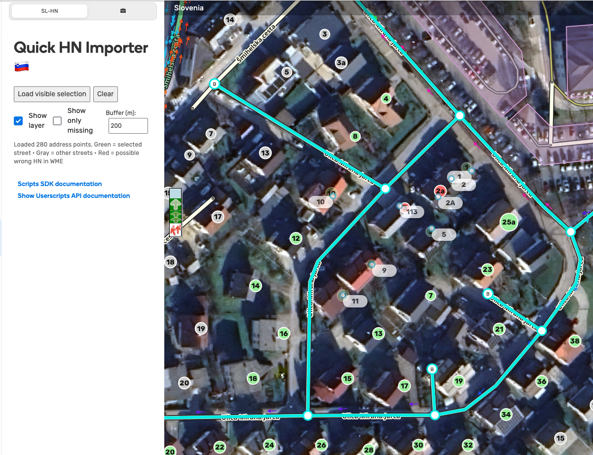

# WME Quick HN Importer – Slovenia 🇸🇮

A **Tampermonkey userscript** for Waze Map Editor (WME) that displays official Slovenian house numbers from **EProstor** directly on the WME map.  
This helps editors quickly add and verify house numbers without manually opening external GIS portals.

---

## 🧭 How It Works

After installing the script, you’ll see a new **SL-HN** tab in the left sidebar of WME.

### Basic workflow
1. **Select a street segment**  
2. Click **“Load selected street”**  
3. The script retrieves nearby address points via EProstor WFS  
4. Circles appear on the map and indicate:

Emoji | Meaning
------|--------
🟢 Green | House numbers belonging to the **selected street** (primary or alternate)
🟠 Orange | House numbers belonging to **other streets**
🟥 Red | **Conflicts**, e.g. a different nearby existing house number
⚪ Faded green | Already present in WME

### 👉 Adding house numbers
**Click any circle to instantly add that house number to the nearest matching segment.**

No manual typing is needed — just click.

You can also:
- Toggle the layer visibility  
- Show only missing house numbers  
- Show only the selected street  
- Adjust the buffer distance (default: 500 m)

---

## ⚠️ Notes & Gotchas

### 🔤 Street name mismatches
If house numbers appear 🟠 orange instead of 🟢 green, the WME street name may not match the official EProstor one.  
Correct the street name in WME first.

### 🟥 Red conflicts
Red numbers appear when:
- Another house number exists nearby but differs  
- Wrong casing (`4A` vs `4a`)  
- Misplaced numbers on the wrong segment  

Always verify manually.

### 🟠 Segments without a street name
If you click a segment **without** a street name:
- The script does **not** clear the selection  
- All markers become 🟠 orange (because no match is possible)

### 📡 Accuracy
EProstor coordinates are normally precise, but always visually verify before adding.

---

## 🛠️ Installation

1. Install **Tampermonkey**  
   https://www.tampermonkey.net/

2. Install the script  
   https://raw.githubusercontent.com/zigapovhe/wme-sl-hn-import/main/wme-sl-hn-import.user.js

3. Reload Waze Map Editor  
4. Open the **SL-HN** tab in the sidebar

---

## 🧩 Technical Info

- Uses WME SDK (`getWmeSdk`) for UI and house-number API  
- Calls EProstor WFS using `GM_xmlhttpRequest`  
- Reprojects EPSG:3794 → EPSG:3857 using `proj4js`  
- Pixel-based hit-testing ensures reliable clicking  
- Settings are preserved via `localStorage`

---

## 👤 Author

Author: **ThatByte**  
Waze: https://www.waze.com/user/editor/ThatByte  
License: **MIT**
