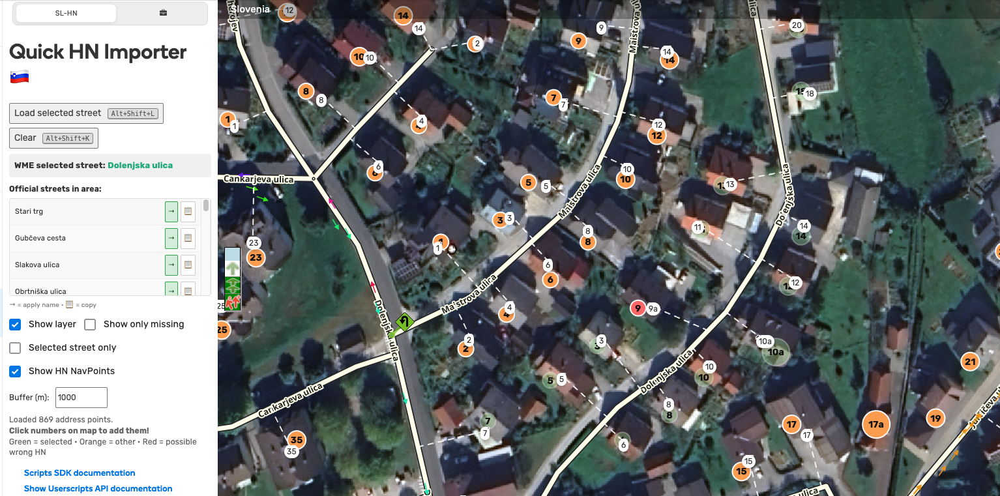

# WME Quick HN Importer – Slovenia 🇸🇮

A **Tampermonkey userscript** for Waze Map Editor (WME) that displays official Slovenian house numbers from **EProstor** directly on the WME map.  
This helps editors quickly add and verify house numbers without manually opening external GIS portals.

---

## 🧭 How It Works

After installing the script, you'll see a new **SL-HN** tab in the left sidebar of WME.

### Basic workflow
1. **Select a street segment**  
2. Click **"Load selected street"**  
3. The script retrieves nearby address points via EProstor OGC API Features
4. Circles appear on the map and indicate:

| Color | Meaning |
|-------|---------|
| 🟢 Green | House numbers belonging to the **selected street** (primary or alternate) |
| 🟠 Orange | House numbers belonging to **other streets** |
| 🔴 Red | **Conflicts**, e.g. a different nearby existing house number |
| ⚪ Faded green | Already present in WME |

### 👉 Adding house numbers
**Click any circle to instantly add that house number to the nearest matching segment.**

No manual typing is needed — just click.

### ⚙️ Options
- Toggle the layer visibility  
- Show only missing house numbers  
- Show only the selected street  
- Adjust the buffer distance (default: 500 m)

## 📍 HN NavPoints Overlay

Optional passive overlay showing every loaded Waze house number as a dashed line from its map pin to its anchor point on the segment, plus the number as a colored label. Color indicates edit state:

- Yellow — untouched default
- White — touched
- Red — untouched + forced
- Orange — touched + forced

Toggle via the "Show HN NavPoints" checkbox. Visible at zoom level 18 and above.

---

### ⌨️ Keyboard Shortcuts

| Shortcut | Action |
|----------|--------|
| `Alt+Shift+L` | Load selected street |
| `Alt+Shift+K` | Clear |

Shortcuts are registered via the WME SDK and appear in the WME keyboard shortcuts dialog. You can reassign them there.

---

## 🆕 Street Name Validation (v2.1.0)

The script now includes **street name mismatch detection** to help you fix incorrect street names.

### How it works

When you load addresses, the script analyzes official street names from EProstor and compares them with the selected WME segment:

| Indicator | Meaning |
|-----------|---------|
| ⚠️ Yellow warning | WME street name doesn't match any official names |
| 💡 Green suggestion | Fuzzy match found (typo, abbreviation, or diacritic difference) |
| ✓ Checkmark | Street name matches the current WME segment |
| → Arrow | Click to apply this street name to the segment |

### One-click street name fix
1. Select a segment with an incorrect street name
2. Load the area
3. Find the correct official name in the list
4. Click **→** to instantly update the segment's street name
5. Circles turn green immediately!

### Features
- **Fuzzy matching**: Detects typos, missing diacritics (e.g., "Šmartinska" vs "Smartinska"), and common abbreviations (c. → cesta, ul. → ulica)
- **Copy to clipboard**: Click 📋 to copy any official street name

---

## 🆕 Fix-Street Assist (v2.3.0)

Previously, clicking a house number whose official street didn't exist in WME popped up a browser dialog offering to attach it to the nearest segment — usually the one carrying the *wrong* name. Now the script helps you fix the street instead:

### How it works

Click a house number whose official street name is missing from WME (or exists only suspiciously far away — more than 50 m and twice as far as the nearest segment):

1. 🔵 All house numbers belonging to that official street are **highlighted blue** on the map
2. The segments that probably carry the wrong or missing name are **pre-selected** in WME — adjust the selection with shift-click if the guess is off
3. A floating dialog shows the official name and offers:

| Button | Action |
|--------|--------|
| ✓ Rename selected segments | Renames whatever is selected to the official name, then adds the clicked house number — circles turn 🟢 green immediately, no save needed |
| 📋 Copy name | Copies the official street name to the clipboard |
| Add to "…" anyway | Attaches the house number without renaming anything (e.g. long driveways where the distant named road really is the right target) |
| ✕ Cancel | Closes the dialog, changes nothing |

### Also in v2.3.0

- Renaming a street now applies to **all** selected segments (previously only the first)
- House numbers are never attached to pedestrian paths, boardwalks, stairways, railroads, or runways
- Circles hidden by the filters or by zooming out are no longer clickable
- Unsaved adds/deletes are tracked more reliably and reconciled when you save

---

## ⚠️ Notes & Gotchas

### 🔤 Street name mismatches
If house numbers appear 🟠 orange instead of 🟢 green, the WME street name may not match the official EProstor one.

**New in v2.1.0**: The script now warns you about mismatches and suggests corrections! Look for the yellow warning box and use the → button to fix street names with one click.

### 🔴 Red conflicts
Red numbers appear when:
- Another house number exists nearby but differs  
- Wrong casing (`4A` vs `4a`)  
- Misplaced numbers on the wrong segment  

Always verify manually.

### 🟠 Segments without a street name
If you select a segment **without** a street name:
- All markers become 🟠 orange (because no match is possible)
- Use the street list to apply the correct name with one click

### 📡 Accuracy
EProstor coordinates are normally precise, but always visually verify before adding.

---

## 🛠️ Installation

1. Install **Tampermonkey**  
   https://www.tampermonkey.net/

2. Install the script  
   https://raw.githubusercontent.com/zigapovhe/wme-sl-hn-import/main/wme-sl-hn-import.user.js

3. Reload Waze Map Editor  
4. Open the **SL-HN** tab in the sidebar

---

## 🧩 Technical Info

- Uses WME SDK (`getWmeSdk`) for UI, house numbers, segments, streets, selection, map layer rendering, events, and keyboard shortcuts
- Calls EProstor OGC API Features using `GM_xmlhttpRequest`
- Reprojects EPSG:3794 (Slovenia D96/TM) ↔ EPSG:4326 (WGS84) using `proj4js`
- CQL filters for coordinate-based queries
- Pixel-based hit-testing ensures reliable clicking
- Settings are preserved via `localStorage`

---

## 👤 Author

Author: **ThatByte**  
Waze: https://www.waze.com/user/editor/ThatByte  
License: **MIT**